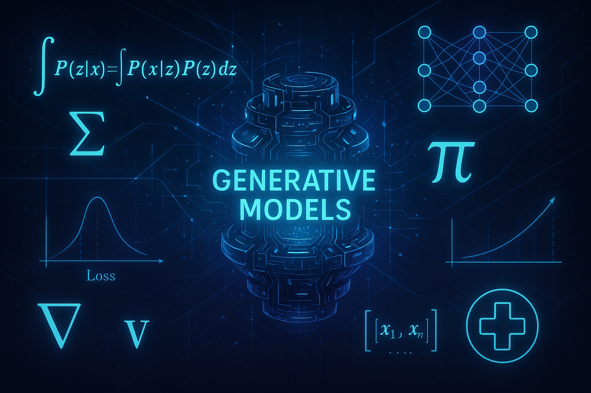

# Fundamentals of Generative models

*This repository presents literature for generative models, with fundamentals tied to mathematics. Furthermore, implementation of essential papers are presented too*

## Overview

### What You'll Find Here

In this repository, you will be able to find materials related to generative models and the necessary fundamental knowledge surrounding the field. 

### Updates

This repository is updated periodically. If you have suggestions for additional resources, fixes or improvements, please feel free to reach out. 
- We are contactable via email (`KIMH0004 at e dot ntu dot edu dot sg`).

### Table of Contents
- [1. Foundational Theory](#1-foundational-theory)
  - [1.1. Stochastic Interpolants](#11-stochastic-interpolants)
- [2. Fundamental papers](#2-fundamental-papers)
- [3. Recent papers](#3-recent-papers)

## 1. Foundational Theory 
### 1.1 Stochastic Interpolants

* [Stochastic Interpolants: A Unifying Framework for Flows and Diffusions](https://arxiv.org/abs/2303.08797) (15 March 2023)

## 2. Fundamental papers

* [Denoising Diffusion Implicit Model](https://arxiv.org/abs/2010.02502) (6 Oct 2020)
* [Denoising Diffusion Probabilistic Models](https://arxiv.org/abs/2006.11239) (19 June 2020)

## 3. Recent papers
