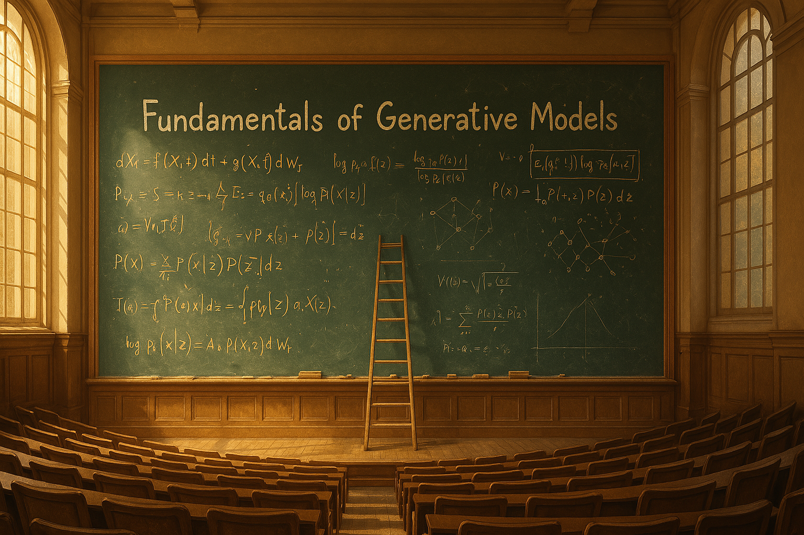

# Fundamentals of Generative models

*This repository presents literature for generative models, with fundamentals tied to mathematics. Furthermore, implementation of essential papers are presented too*

## Overview

### What You'll Find Here

In this repository, you will be able to find materials related to generative models and the necessary fundamental knowledge surrounding the field. 

### Updates

This repository is updated periodically. If you have suggestions for additional resources, fixes or improvements, please feel free to reach out. 
- We are contactable via email (`KIMH0004 at e dot ntu dot edu dot sg`).

### Table of Contents
- [1. Foundational Theory](#1-foundational-theory)
  - [1.1. Stochastic Interpolants](#11-stochastic-interpolants)
  - [1.2. Score-Based Methods](#12-score-based-methods)
  - [1.3. Flow Matching](#13-flow-matching)
- [2. Generative Modeling](#2-gen-modeling)
- [3. Important links](#3-important-links)

## 1. Foundational Theory 
### 1.1 Stochastic Interpolants

* [Stochastic Interpolants: A Unifying Framework for Flows and Diffusions](https://arxiv.org/abs/2303.08797) (15 March 2023)  
* [Diffusion process](./foundational_theory/diffusion_process/) 

### 1.2 Score-Based Methods

* [Generative Modeling by Estimating Gradients of the Data Distribution (Noise Conditional Score Networks)](https://arxiv.org/abs/1907.05600) (12 July 2019)  
* [Score-Based Generative Modeling through Stochastic Differential Equations](https://arxiv.org/abs/2011.13456) (7 Nov 2020)  

### 1.3 Flow Matching

* [Flow Matching for Generative Modeling](https://arxiv.org/abs/2201.13413) (31 Jan 2022)  

## 2. Generative Modeling

* [Classifier-Free Diffusion Guidance](https://arxiv.org/abs/2207.12598) (26 July 2022)  
* [Improved Denoising Diffusion Probabilistic Models](https://arxiv.org/abs/2102.09672) (22 Feb 2021)  
* [Diffusion Models Beat GANs on Image Synthesis](https://arxiv.org/abs/2105.05233) (10 May 2021)  
* [Denoising Diffusion Restoration Models](https://arxiv.org/abs/2106.10194) (21 June 2021)  
* [Elucidating the Design Space of Diffusion-Based Generative Models](https://arxiv.org/abs/2206.00364) (1 June 2022)  
* [High-Resolution Image Synthesis with Latent Diffusion Models](https://arxiv.org/abs/2112.10752) (20 Dec 2021)  
* [Denoising Diffusion Implicit Model](https://arxiv.org/abs/2010.02502) (6 Oct 2020)  
* [Denoising Diffusion Probabilistic Models](https://arxiv.org/abs/2006.11239) (19 June 2020)  
* [Score Distillation Sampling for Text-to-Image Generation](https://arxiv.org/abs/2208.09199) (17 Aug 2022)  

## 3. Important links

* [Reverse diffusions, Score & Tweedie](https://alexxthiery.github.io/notes/reverse_and_tweedie/reverse_and_tweedie.html)  
* [CS492(D) Diffusion Models and Their Applications (KAIST, Fall 2024)](https://mhsung.github.io/kaist-cs492d-fall-2024/)