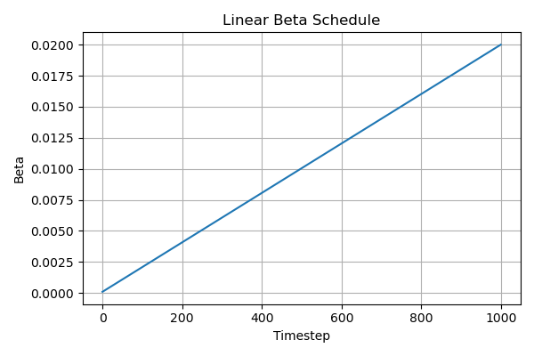
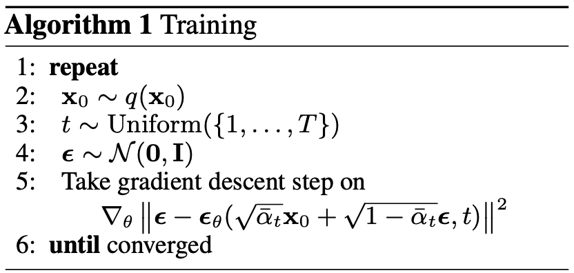
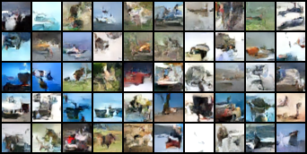
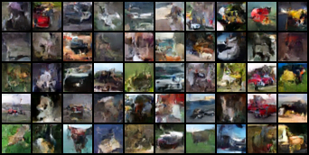

# DDPM/DDIM implementation 

This is the implementation of DDPM and DDIM papers. 
There is not much difference between these two ideas as DDPM is a special case of DDIM where full randomness is introduced. 
Sampling code for DDIM can be found under `sample_ddim` function in `ddpm.py`

## Walk Through

  
  
<em>Figure: Plot of our linear scheduler following the paper's specifications.</em>

The DDPM model is trained using the linear scheduler as suggested by the paper, with a thousand timesteps. 
The linear scheduler defines the sequence of betas over a fixed number of timesteps. The betas are the ones controlling the 
Gaussian noise added at each step of the forward diffusion process. As we can see in the plot, the noise added increases over time 
throughout the forward process. 

The training code closely follows the pseudocode provided by the paper:

  
  
<em>Figure: Pseudocode for the training algorithm.</em>

Our scheduler's `q_sample` code reproduces the forward process, producing noisy samples from random timesteps. Using these samples, the model is then trained to predict the noise at the respective timesteps. Loss function is a simple MSE loss (Eq. 12) and is used to train our 'noise predicting' model. 

For sampling, DDIM does not require a separately trained model. The DDPM trained model can be used for DDIM inference. The key takeaway from the DDIM paper is that we can achieve relatively similar performance at a much reduced cost and time. It does this by taking fewer timesteps for inference. This is achieved by DDIM using a non-Markovian reverse process, where it depends implictily on `x_0` and thus indirectly on the full trajectory. Even though with DDIM, we are trading quality for efficiency, tt is said that quality degradation is mitigated when the DDIM reverse process becomes more determinisitic, where the eta `->` 0. This is shown in the results table below. 

## Results 

| Model     |   FID   | Training steps | eta | Inference steps | Epochs | 
|-----------|---------|----------------|-----|-----------------|--------|
| DDPM      | 62.8162 |      1000      |  -  |       1000      |   200  |
| DDIM      | 64.6806 |      1000      | 0.5 |        100      |   200  |
| DDIM      | 64.2164 |      1000      | 0.4 |        100      |   200  |
| DDIM      | 65.4582 |      1000      | 0.3 |        100      |   200  |
| DDIM      | 63.9458 |      1000      | 0.2 |        100      |   200  |
| DDIM      | 67.6040 |      1000      | 0.1 |        100      |   200  |

## Generated images

  
  
<em>Figure: Samples generated by DDPM at epoch 200. FID score: 62.82.</em>

  
  
<em>Figure: Samples generated by DDIM at epoch 200. FID score: 64.68.</em>

## References 

* [Denoising Diffusion Implicit Model](https://arxiv.org/abs/2010.02502) (6 Oct 2020)
* [Denoising Diffusion Probabilistic Models](https://arxiv.org/abs/2006.11239) (19 June 2020)
* [Reference Code](https://ziseoklee.github.io/)