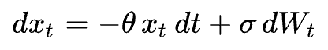
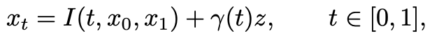
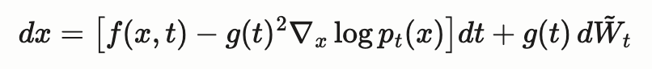

# Diffusion process

## Forward process

The forward diffusion process is crucial to the family of diffusion models, such as Denoising Diffusion Probabilistic Models (DDPM) and Denoising Diffusion Implicit Models (DDIM). It represents the noising process (process of adding random noise), which translates an initial data distribution to a reference data distribution, which is normally a Gaussian Distribution. 

This is one example of a forward process that could be used, known as the Ornstein–Uhlenbeck process, where `x_t` is the process while `W_t` denotes the Wiener process. 

The choice of the stochastic process depends on the goals and different types of the diffusion models. For stochastic interpolants, such process might be used. 

All of them differ in their equations but have the same idea to start from an initial data distribution and end up in a reference data distribution. 

## Reverse process

The reverse process can be understood as a 'denoising' process. We seek to learn the noise that was added throughout the forward process and remove it step by step to obtain back our original image. 

This is the general reversed SDE that is used to simulate the 'denoising' process. This work can be seen in [here](https://www.sciencedirect.com/science/article/pii/0304414982900515) where Brian Anderson showed 'how most processes defined via a forward-time or conventional diffusion equation model have an associated reverse-time model.'. The divergence of the log is referred to as the 'Score' and this is the key element that Deep Learning models attempt to learn and predict, so that we can simulate the reverse process to obtain our initial data distribution, whether that be an image, video, audio or whatever modality it initially was.  